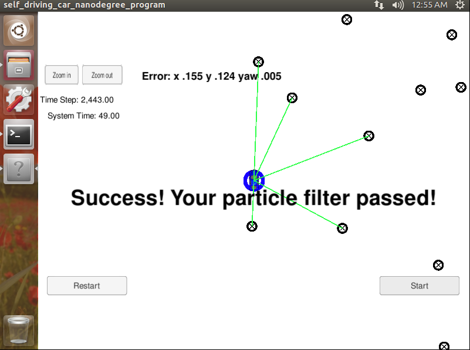

# 粒子滤波器


## 项目描述
粒子滤波器定位一个被绑架的车辆( kidnapped and transported to a new location)，运动的车辆具有初始的GPS定位信息，大量(噪声)传感器/控制数据。

本项目的目标是根据给定的地图以及初始定位信息，在地图中指定运动小车位置(定位)。当然，在运动过程中，每一个时间步下会为滤波器提供观测与车辆控制数据（机器人状态）


## 运行代码
Term 2 模拟器的下载链接  [here](https://github.com/udacity/self-driving-car-sim/releases)

 following from the project top directory.

```shell
mkdir build

cd build

cmake ..

make

./particle_filter
```

亦可以通过执行以下shell命令来运行程序，但其执行过程（需加载shell）较上一方法慢不少，运行结果可能出现`run out of time`，而直接执行`./particle_filer`可避免此问题。

```shell
./clean.sh
./build.sh
./run.sh
```


# 代码结构
`main.cpp`已经是给定了，其主要负责通过uWebSocketIO与模拟器进行通信


INPUT：由模拟器提供给c ++程序的值

// 从模拟器中感测到的嘈杂位置数据

["sense_x"] 

["sense_y"] 

["sense_theta"] 

// 得到前一时间步的速度和偏航率，用来预测粒子的过渡状态

["previous_velocity"]

["previous_yawrate"]

// 从x / y值的相应列表中, 接收来自模拟器的噪声观测数据

["sense_observations_x"] 

["sense_observations_y"] 


OUTPUT: values provided by the c++ program to the simulator

// 用于计算误差评估的最佳粒子值

["best_particle_x"]

["best_particle_y"]

["best_particle_theta"] 

//用于调试粒子感应的可选消息数据，以及相应（x，y）感应位置ID标签的关联

["best_particle_associations"]

// 对应的观测位置 (x,y) 值

["best_particle_sense_x"] <= list of sensed x positions

["best_particle_sense_y"] <= list of sensed y positions

粒子滤波器的核心代码在 `particle_filter.cpp`中，当 模拟器输出:

```
Success! Your particle filter passed!
```

代表运行成功。整个项目的文件结构如下所示：

```
root
|   build.sh
|   clean.sh
|   CMakeLists.txt
|   README.md
|   run.sh
|
|___data
|   |   
|   |   map_data.txt
|   
|   
|___src
    |   helper_functions.h
    |   main.cpp
    |   map.h
    |   particle_filter.cpp
    |   particle_filter.h
```


输入的地图参数文件在data文件夹下，即`map_data.txt` ，包括地图笛卡尔坐标系测量点的x,y值以及id编号，观测粒子点以及控制参数由模拟器另外提供。

> * Map data provided by 3D Mapping Solutions GmbH.

## 评估标准
m模拟器判断是否pass有以下两个依据：


1. **准确度**: 小车的状态误差应小于 `src/main.cpp`中的 `max_translation_error` 和 `max_yaw_error` 。

2. **性能**: 需要在100s内执行完2440个时间步


